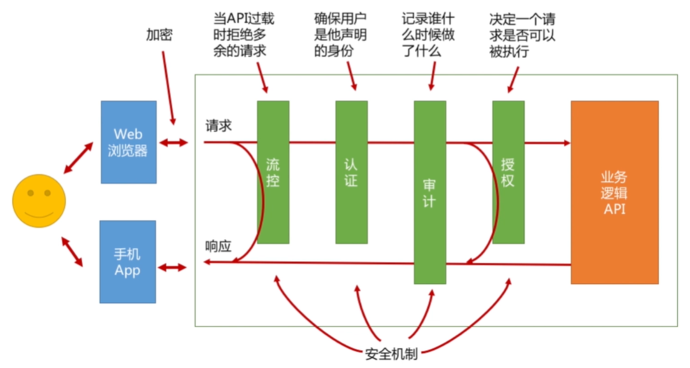
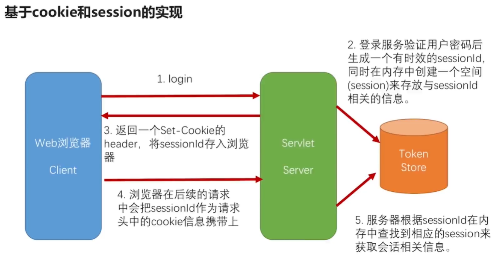
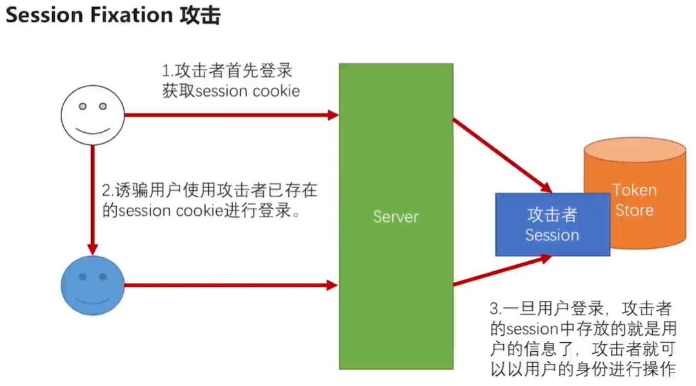

## 1、登陆

​		在前面，我们把图上常见的安全机制都做了一个简单的实现，但是登陆并没有在图中体现，因为并不是每次调用API的时候都需要登陆；登陆只是一个偶尔发生的事情，并不像图中的机制，每一次API的调用都贯穿在其中。但登陆也是整个安全机制中，重要的一环。

## 2、之前认证中（HttpBasic）存在的缺陷

​		在前面我们实现的HttpBasic认证逻辑中，每次客户端发请求的时候都要把用户的用户名密码通过base64加密传上来，这样有以下缺点：

​	2.1、不安全，每次请求都要带用户名和密码，增加了用户名密码泄漏的风险

​	2.2、每一次传上来用户名和密码以后都要去做check，加密算法校验比较消耗系统资源

## 3、基于token的身份认证

​		对于上面的问题，我们可以采用基于token的身份认证，流程如下图；

​		这样做的好处是：token跟用户名密码是有关联的，但不是直接的关联，从token中没有办法解析出用户名和密码的。不用每次都传用户名和密码，token在服务器端有一个存储，服务器端从客户端拿到token以后，查一下存储中是否存在，就知道用户是否登陆了，不用像之前那样每次请求都要做密码比对。

## 4、基于cookie和session的实现

​		对于基于token的身份认证实现有很多，对于java来说最常见的就是基于cookie和session的实现，流程如下图；Web浏览器作为客户端，Servlet容器作为服务器端（tomcat等），服务器端的内存作为token存储。

​		上面的这套逻辑Servlet规范里面都替我们实现好了，我们只需要在代码中执行request.getSession()，就会为我们做上面的生成sessionId，返回set-Cookie这些事情。

​		优点：提升了客户体验，比客户端保存用户名密码安全；使用起来很方便，Servlet容器都替我们实现好了。

​		缺点：只针对浏览器可以使用，APP和第三方应用不支持；服务器向浏览器传递cookie容易被劫持；多台服务器要保证session的一致性。

## 5、session固定攻击

​		request.getSession()这句代码会根据请求里面cookie的sessionId，在服务器上去找对应的session，如果能找到直接用，如果没找到就会创建一个新的session然后返回回去。针对这样一个逻辑，黑客发明了session固定攻击，如下图

​			为了防止session固定攻击，我们要保证登陆前和登陆后的session不是同一个。

## 6、代码实现

​	见项目代码