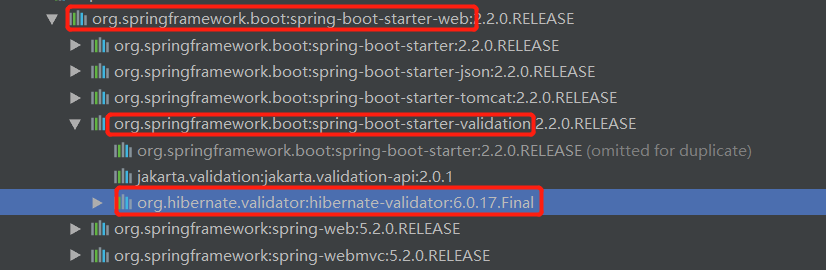

## 1、为什么要做数据校验

​		要保证系统的安全性，健壮性，数据校验必不可少，校验参数的合法性，不能因为前端或者其它调用段因为参数传的不对导致我们的系统报错。

## 2、开发中参数校验做在哪里

​		一般都是做在接口层面，对传入的参数进行校验。

## 3、Bean Validation

​		对于Controller接口的参数校验，如果参数较少可以自己写代码进行校，但是如果参数较多，就会由一堆if-else，代码不美观。我们可以使用Bean Validation来进行参数校验，Bean Validation是一种Java规范，可以允许使用注释来对对象上的字段进行约束，也可以自定义约束。从1.0（JSR303），1.1（JSR349）发展到现在的2.0（JSR380）。使用Bean Validation 2.0需要Java 8或更高版本，由Hibernate Validator作为提供商。

## 4、在SpringBoot中使用Bean Validation

​		如果我们使用了spring-boot-starter-web依赖，那么就会自动为我们将相关依赖添加进来。如果想单独使用的话，需要添加spring-boot-starter-validation依赖。

## 5、Bean Validation中的校验注解

validation-api中在javax.validation.constraints包下提供了一系列标准校验注解

​		@AssertFalse：值必须是false。支持的类型有boolean和Boolean。null值被认为是合法的。

​		@AssertTrue：值必须是true。支持的类型有boolean和Boolean。null值被认为是合法的。

​		@DecimalMax：值必须小于等于value指定的值；是否包含value由inclusive控制，默认为包含（true）。支持的类型有BigDecimal、BigInteger、字符串、byte、short、int、long及其包装类。不支持double和float。null值被认为是合法的。

​		@DecimalMin：值必须大于等于value指定的值；是否包含value由inclusive控制，默认为包含（true）。支持的类型有BigDecimal、BigInteger、字符串、byte、short、int、long及其包装类。不支持double和float。null值被认为是合法的。

​		@Digits：必须是指定范围内的数字。integer指定整数部分最大长度；fraction指定小数部分最大长度。支持的类型有BigDecimal、BigInteger、字符串、byte、short、int、long及其包装类。null值被认为是合法的。

​		@Email：字符串必须是格式正确的电子邮件地址。也可以通过regexp和flag指定自定义的email格式。null值被认为是合法的。

​		@Future：必须是未来的时间或日期。支持的类型有Date、Instant、LocalDate、LocalDateTime、LocalTime等常用时间日期类。null值被认为是合法的。

​		@FutureOrPresent：必须是当前或未来的时间或日期。支持的类型有Date、Instant、LocalDate、LocalDateTime、LocalTime等常用时间日期类。null值被认为是合法的。

​		@Max：值必须小于等于指定的value。支持的类型有BigDecimal、BigInteger、byte、short、int、long及其包装类。不支持double和float。null值被认为是合法的。

​		@Min：值必须大于等于指定的value。支持的类型有BigDecimal、BigInteger、byte、short、int、long及其包装类。不支持double和float。null值被认为是合法的。

​		@Negative：值必须是负数（小于零）。支持的类型有BigDecimal、BigInteger、byte、short、int、long、float、double及其包装类。null值被认为是合法的。

​		@NegativeOrZero：值必须小于等于零。支持的类型有BigDecimal、BigInteger、byte、short、int、long、float、double及其包装类。null值被认为是合法的。

​		@NotBlank：字符串不能为空，并且必须至少包含一个非空白字符。null值不合法。

​		@NotEmpty：值不能为空。支持的类型，字符串不能为null且长度不能为0；集合不能为null且不能为空；Map不能为null且不能为空；数组不能为null且不能为空。

​		@NotNull：值不能为null。支持任何类型。

​		@Null：值必须是null。支持任何类型。

​		@Past：必须是过去的时间或日期。支持的类型有Date、Instant、LocalDate、LocalDateTime、LocalTime等常用时间日期类。null值被认为是合法的。

​			@PastOrPresent：必须是当前或过去的时间或日期。支持的类型有Date、Instant、LocalDate、LocalDateTime、LocalTime等常用时间日期类。null值被认为是合法的。

​		@Pattern：必须与指定的正则表达式匹配。null值被认为是合法的。

​		@Positive：值必须是正数（大于零）。支持的类型有BigDecimal、BigInteger、byte、short、int、long、float、double及其包装类。null值被认为是合法的。

​		@Size：个数必须在指定的min和max之间（包括min和max）。支持的类型字符串长度，集合中元素个数，Map中键值对个数，数组的长度。null值被认为是合法的。

hibernate-validator中在org.hibernate.validator.constraints包下也提供了一系列校验注解，常用的如下：

​		@Length：字符串长度在指定的min和max之间（包括min和max）。null值被认为是合法的。

​		@Range：值必须在适当的范围min和max之间（包括min和max）。应用于数值或数值的字符串表示形式。null值被认为是合法的。
​		@URL：字符串是否为URL。也可以通过regexp和flag指定自定义的email格式。null值被认为是合法的。

## 6、添加用户使用参数校验

​		6.1、UserDTO上添加校验注解

​		6.2、在接口类上添加@Validated注解

​		6.2、在接口上添加@Validated或@Valid注解

## 7、异常结果处理1

​		错误参数访问时，通过控制台打印可以知道会抛出一个org.springframework.web.bind.MethodArgumentNotValidException异常，我们对其进行捕获并处理，使返回结果更友好。

## 8、分组校验

​		对于添加用户，我们是不需要用户id的，但是修改用户是需要用户id的。这时怎么进行校验呢？Bean Validation为我们提供了分组功能，其实每一个校验注解都有一个groups属性，且默认为空（Default分组）。

​	8.1、新建两个接口，Create、Update并继承Default接口。（不继承的话，不会校验默认分组）

​	8.2、修改UserDTO上id的注解，为其添加分组

​	8.3、在接口的@Validated上添加分组

## 9、级联校验（对象属性中的属性校验）

​		对于属性是对象的，如果我们只添加了@NotNull注解，它也不会去校验该对象中的属性，如果想要进行校验，需要添加@Valid注解。

## 10、自定义注解校验

​		如果给我们提供的校验注解不能满足我们的需求时，我们可以自定义校验注解。

​		10.1、创建一个注解，找一个原有校验注解进行copy，修改@Constraint指定校验逻辑（可以指定多个），和所需要的属性即可。

​		10.2、创建校验器，实现ConstraintValidator接口，并指定要校验的注解和要校验的类型，initialize可以获得注解上的属性，进行初始化；isValid校验逻辑。

## 11、list中做分组校验

​		11.1、将@Validated(Create.class)注解添加在方法上

​		11.2、在List中添加@Valid注解

## 12、异常结果处理2

​		错误参数访问时，通过控制台打印可以知道会抛出一个javax.validation.ConstraintViolationException异常，我们对其进行捕获并处理，使返回结果更友好。

## 13、属性之间的关联校验

​		这里我们可以自定义一个类校验注解，这样就可以拿到所有的属性，然后进行校验。

Bean Validation官网：<https://beanvalidation.org/>

Hibernate Validator官方参考文档：<https://docs.jboss.org/hibernate/stable/validator/reference/en-US/html_single/#preface>

