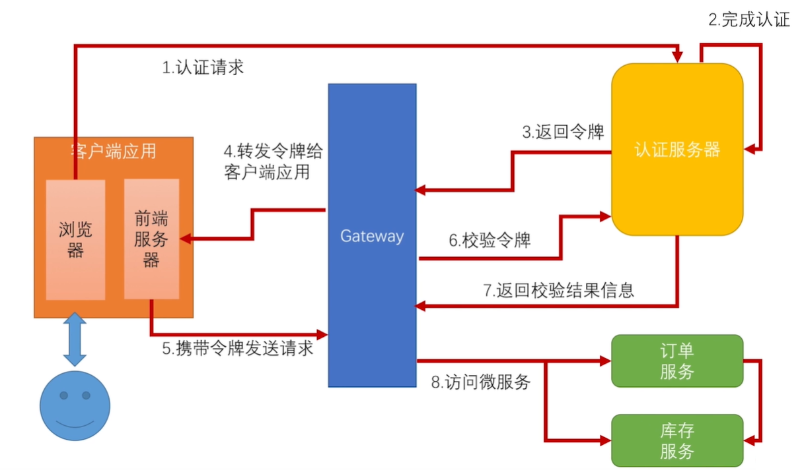

​		目前为止，我们已经实现了一个基于微服务，前后端分离的架构(前端服务使用SpringBoot模拟)，如上图；并且在网关上做了限流、认证、审计、授权等安全机制；在前端做了SSO单点登陆。

​		但是目前的架构还是有一些问题的：

1、限流：

​		在前面网管安全我们也说过网关上不要做细粒度的限流，主要为服务器硬件设备的并发处理能力做限流。但是对于各位服务之间，比如说订单限流100，库存限流100，订单调用了库存。网关转发100到订单，转发100到库存，并且这订单的100各请求也调用库存，库存请求达到200，服务可能就会挂掉。

2、认证：

​		目前的做法是，经过OAuth2流程以后，给前端发送令牌。每次前端请求都会带着这个令牌，在网关上，回调用认证服务器校验这个令牌。通过后再请求头中放入username，再转发到其他微服务，其他微服务从请求头中获取username，得到当前用户。

​		改流程存在以下问题：

​		2.1、效率低：网关上每个请求都要取认证服务器校验令牌。多一次网络开销，认证服务器压力也会变大，并且如果认证服务器挂了，所有的请求都无法访问微服务了。

​		2.2、不安全：传递用户信息，是再请求头中添加username，网关转发到订单服务，订单服务从请求头中获取用户信息，那么如果再有一个别的服务，直接调用订单服务，在请求头中添加一个username，订单服务也会认为是该用户请求的，不安全。我们不能通过请求或请求头中的一个明文参数来判断一个用户是谁。

3、授权：

​	只能控制当前请求是否能调用某个微服务，而不能控制微服务之间的调用。

4、服务雪崩：

​		如果某个微服务因为网络或数据库等问题，导致服务响应变慢，再有别的服务对他进行调用，别的服务也会变慢。仅仅是因为一个服务除了问题，而导致大量的服务不可用。

接下来，我们就来解决这些问题。

