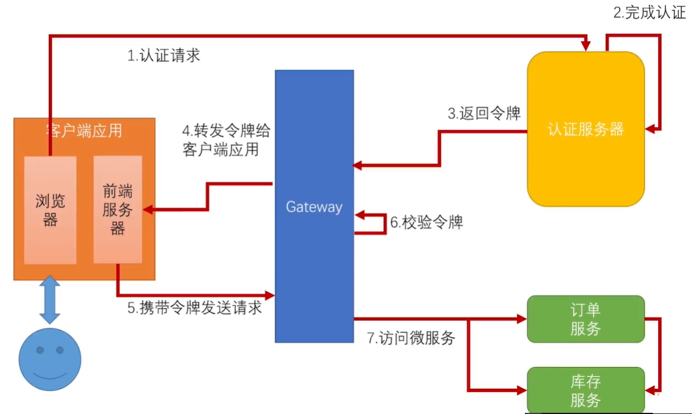

## 1、使用JWT来解决认证中存在的问题

​		之前说认证中存在的问题是效率低，每次都要取认证服务器进行校验；不安全，传递用户信息是放到请求头中的明文。这两个问题的解决方案就是JWT。对于JWT不了解的可以去官网扫盲<https://jwt.io/introduction/>。

​		因为我们之前发出去的令牌都是一些无意义的串，而JWT中可以包含一些用户信息，这样前端发请求过来，网关就不需要去认证服务器校验了，我们只需要校验这个JWT是否被串改，并且从里面将用户信息读出来就可以了，往下转发传递和服务与服务之间进行调用时，只需要传递JWT就可以了。并且Spring给我们提供了工具，不用我们自己写代码就可以完成。我们要将架构改成下图

## 2、认证服务器改造，使其发送JWT令牌

2.1、将tokenStore改为JwtTokenStore

## 3、网关和资源服务器改造

3.1、导入spring-cloud-starter-oauth2依赖

3.2、配置获取令牌签名的验证密钥地址

3.3、网关资源服务器配置，放过申请令牌请求

3.4、资源服务器进行调用时，要使用OAuth2RestTemplate，他会帮助我们传递令牌

