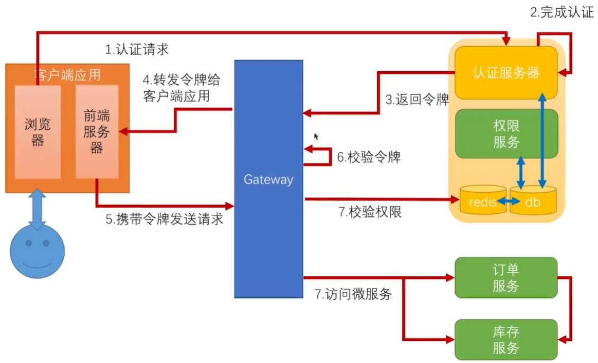

​		上节我们使用JWT优化了认证机制，通过令牌可以解析出当前用户是谁，并且这个令牌可以在网关到微服务，微服务和微服务之间传递，现在我们来看一下权限的控制

## 1、简单的ACL控制

​		最简单的情况就是ACL（访问控制列表），能干什么都在scope里面，但是scope是针对客户端应用的，无法控制各个用户可以做什么，可以使用用户里的authorities来进行判断。我们只需要在程序里判断一下，访问这个方法有没有相应的权限就可以了。可以在springsecurity中进行配置，也可以使用注解，这里我们使用注解。

1.1、添加@EnableGlobalMethodSecurity注解并开启prePostEnabled

1.2、在方法上可以使用@PreAuthorize注解进行方法前权限校验

## 2、在网关上做复杂的权限控制

​		上面直接在方法上控制权限，适用于比较简单的场景，只有几个角色，就可以实现权限控制。但是没有办法应付复杂的场景，比如说用户的角色权限是动态变化的，上面的方式就无法进行控制了。下面我们来看一下，要实时的去做授权怎么来做。

​		一般，我们对于复杂的权限控制，都是会有一个权限服务的，和订单服务、库存服务一样都是一个微服务；前端会有相关的页面可以对用户的角色权限实时进行修改，配置到数据库中，在同步到redis中，权限系统可以提供一个接口，用来来判断当前请求是否有相应的权限。请求发到网关经过校验令牌之后，网关去校验该请求的权限，有权限就转发，没有权限就返回。我们把认证服务器和权限服务整个一块称为安全中心。

2.1、在网关上写一个权限控制服务，可以去安全中心进行权限判断

2.2、将我们的服务添加到评估上下文中，使其可以被解析

2.3、在网关资源服务器配置类中进行配置

## 3、微服务之间的权限控制

​		如果权限控制都在网关上管理，那么有可能就会出现，用户A可以访问订单服务，但是不能访问库存服务。但是用户A在访问订单服务的时候，订单服务可以访问库存服务，这样的话，就越权了。这个场景怎么解决呢？可以在每个微服务上都去调用安全中心判断权限，和网关上做法差不多，但是不建议这么做。

​		推荐的做法是，细粒度的权限，每个请求可不可以访问在网关上做，可以覆盖95%-99%的权限。到了后面的微服务与微服务之间，我们只需要做粗粒度的黑白名单控制即可。比如所我们有一个跟钱相关的结算服务，可以控制只能订单服务来调用，其他服务不可以调用。

