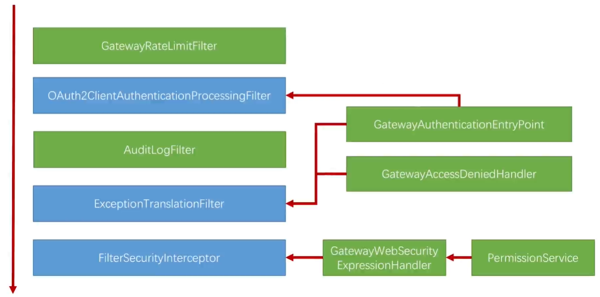

		前面我们已经完成了通过JWT的认证和授权的改造，可以看到我们的代码中没有认证和授权的过滤器（Filter）了，基本上由SpringSecurity的过滤器来接管了，接下来我们来看一下怎么在SpringSecurity的过滤器链上加上我们自己的逻辑，比如日志和限流。

## 1、在SpringSecurity过滤器链上添加日志过滤器

1.1、创建日志过滤器

1.2、将日志过滤器添加到SpringSecurity过滤器链上，要添加在认证之后授权之前（ExceptionTranslationFilter处理授权抛出来的错误，所以添加在这个过滤器之前就可以了）

## 2、403访问拒绝的处理

​		在SpringSecurity中，对于403访问拒绝是由AccessDeniedHandler接口的实现来处理的，在OAuth2中默认使用的是OAuth2AccessDeniedHandler，我们可以写一个自己的处理器，在这个处理器中，可以记录日志，可以自定义返回内容。

2.1、自定义AccessDeniedHandler

2.2、添加到ResourceServerSecurityConfigurer配置中

## 3、401认证失败的处理

​		在SpringSecurity中，对于401身份认证的处理是由AuthenticationEntryPoint接口的实现来处理的，在OAuth2中默认使用的是OAuth2AuthenticationEntryPoint，同样，我们可以自定义AuthenticationEntryPoint接口的实现来记录日志，自定义返回内容的。需要注意的是如果传入错误的令牌，在认证过滤器就会认证失败，由AuthenticationEntryPoint来进行处理，这种情况请求不会经过日志过滤器。如果没有传令牌，认证过滤器会创建一个匿名的Authentication（AnonymousAuthenticationToken）,继续往下走，至于是不是能够访问，由授权来决定。

3.1、首先修改一下PermissionService要求所有的请求都要经过身份认证

3.2、自定义AuthenticationEntryPoint

3.3、添加到ResourceServerSecurityConfigurer配置中

## 4、在SpringSecurity过滤器链上添加限流过滤器

4.1、导入guava依赖

4.2、编写限流过滤器

4.3、添加到SpringSecurity过滤器链上，SecurityContextPersistenceFilter是整个SpringSecurity过滤器链上的第一个，添加在它之间即可

## 5、梳理JWT改造后的整体流程

​		上图就是在我们写的安全机制中主要涉及的过滤器和组件，左边的都是过滤器（FilterSecurityInterceptor虽然不是以Filter结尾的，但也是过滤器），右边都自己写的组件，组件的作用是改变或增强过滤器的行为。其中绿色的都是我们自己写的，蓝色的都是SpringSecurity写的，SpringSecurity写的有它自己的默认行为，我们自己写的组件注入到SpringSecurity的过滤器里面，来改变或者增强SpringSecurity过滤器的行为。

​		执行的顺序就是左边从上到下，首先是GatewayRateLimitFilter我们自己写的用来限流的，然后第二个OAuth2ClientAuthenticationProcessingFilter作用是从令牌中将当前用户身份提取出来，下面是AuditLogFilter我们用来记录审计日志，后面ExceptionTranslationFilter是一个异常转换过滤器，本身没有任何业务逻辑，它作用就是cache后面FilterSecurityInterceptor抛出来的异常，FilterSecurityInterceptor的作用就是判断权限，我们写的PermissionService最终就是在这里生效的。

​		一个请求过来，就会按顺序执行这些过滤器(SpringSecurity还有一个其他的过滤器，但是跟我们的核心没有关系)，我们会把自己写的权限判断逻辑放到PermissionService里，然后把PermissionService给到GatewayWebSecurityExpressionHandler表达式处理器，然后把表达式处理器给到FilterSecurityInterceptor，最终，我们在代码中写的表达式("#permissionService.hasPermission(request,authentication)")会由GatewayWebSecurityExpressionHandler处理，然后交给PermissionService。在FilterSecurityInterceptor中进行权限判断时，如果没有权限会抛出相应异常，会被ExceptionTranslationFilter捕获住，然后根据抛出的异常去调用相应的处理器，在安全的错误中，一共就两种异常，401和403。401交给GatewayAuthenticationEntryPoint来处理，403交给GatewayAccessDeniedHandler来处理，这两个组件都是注到ExceptionTranslationFilter中来进行相应的处理，同时GatewayAuthenticationEntryPoint也会被注入到OAuth2ClientAuthenticationProcessingFilter里面，因为如果令牌传的不对，OAuth2ClientAuthenticationProcessingFilter会直接抛出401的异常给GatewayAuthenticationEntryPoint处理。

​		这就是我们根据JWT改造完，在网关上所做的事情和逻辑。

