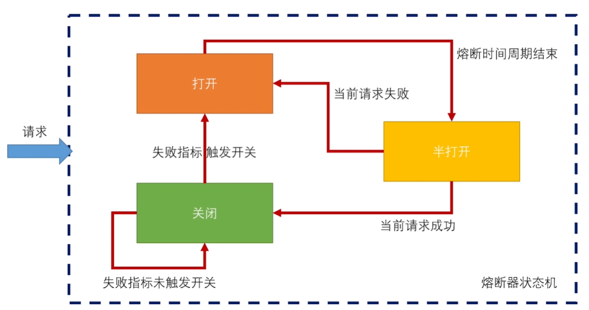

## 1、Sentinel注解支持

​		在学习熔断降级之前，我们先来看一下Sentinel的注解支持，我们使用spring-cloud-starter-alibaba-sentinel依赖，无需额外配置即可使用@SentinelResource注解定义资源。

@SentinelResource 用于定义资源，并提供可选的异常处理和 fallback 配置项。常用属性如下：

value：资源名称，必需项（不能为空）；
blockHandler / blockHandlerClass: blockHandler 对应处理 BlockException 的函数名称，可选项。blockHandler 函数访问范围需要是 public，返回类型需要与原方法相匹配，参数类型需要和原方法相匹配并且最后加一个额外的参数，类型为 BlockException。blockHandler 函数默认需要和原方法在同一个类中。若希望使用其他类的函数，则可以指定 blockHandlerClass 为对应的类的 Class 对象，注意对应的函数必需为 static 函数，否则无法解析。

## 2、熔断器

​		前面我们说过，如果依赖的服务不可用，导致服务自身被拖垮，并将不可用逐渐放大的过程叫做服务雪崩。为了防止雪崩效应，必须有一个强大的容错机制。试想一下，如果家里没有熔断器，当电流过载时，电路不断开，可能会引发烧断电路、引发火灾。使用熔断器，电路一旦过载就会跳闸，从而可以保护电路的安全。当电路过载的问题解决后，只须关闭熔断器，电路就可以恢复正常。

​		同样，如果某个微服务不可用时，再去让新的请求去访问该服务已经没有任何意义，只会无谓消耗资源。所以我们要在需要的地方加上熔断器，熔断器有三种状态，状态转换如下：

​	a、正常情况下，熔断器关闭，可正常请求依赖的服务。

​	b、当一段时间内，请求失败率达到一定阈值（例如调用超时或异常比例升高），熔断器就会打开。此时，不会在去请求依赖的服务。

​	c、熔断器打开一段时间后，会自动进入“半打开”状态。此时，熔断器可允许一个请求访问依赖的服务。如果该请求能够成功调用，则关闭熔断器；否则继续保持打开状态。

## 3、Sentinel熔断降级

​		Sentinel熔断降级会在调用链路中某个资源出现不稳定状态时，对这个资源的调用进行限制，让请求快速失败，避免影响到其它的资源而导致级联错误。当资源被降级后，在接下来的降级时间窗口之内，对该资源的调用都自动熔断（默认行为是抛出 DegradeException）。

​		Sentinel中有以下降级策略：

平均响应时间 （RuleConstant.DEGRADE_GRADE_RT）：当1s内持续进入5个请求，对应时刻的平均响应时间（秒级）均超过阈值（count，以 ms 为单位），那么在接下的时间窗口（DegradeRule 中的 timeWindow，以 s 为单位）之内，对这个方法的调用都会自动地熔断（抛出 DegradeException）。注意Sentinel默认统计的RT上限是4900ms，超出此阈值的都会算作4900ms，若需要变更此上限可以通过启动配置项 -Dcsp.sentinel.statistic.max.rt=xxx 来配置。

异常比例 (RuleConstant.DEGRADE_GRADE_EXCEPTION_RATIO)：当资源的每秒请求量 >= 5，并且每秒异常总数占通过量的比值超过阈值（DegradeRule 中的 count）之后，资源进入降级状态，即在接下的时间窗口（DegradeRule 中的timeWindow，以 s 为单位）之内，对这个方法的调用都会自动地返回。异常比率的阈值范围是 [0.0, 1.0]，代表 0% - 100%。

异常数 (RuleConstant.DEGRADE_GRADE_EXCEPTION_COUNT)：当资源近1分钟的异常数目超过阈值之后会进行熔断。注意由于统计时间窗口是分钟级别的，若 timeWindow 小于 60s，则结束熔断状态后仍可能再进入熔断状态。

