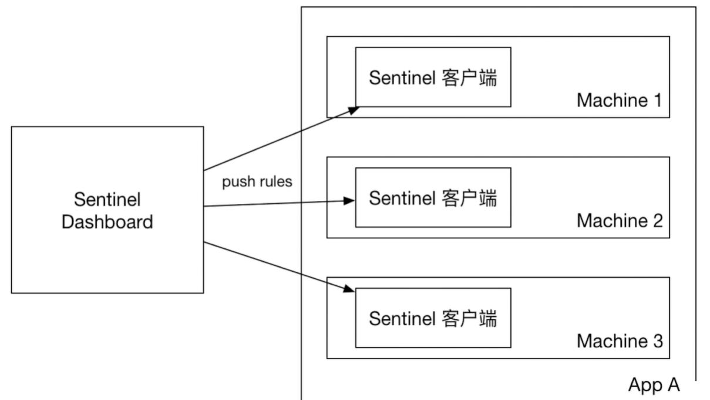

## 1、规则持久化

​		现在我们配置的规则实际上是在内存中的，如果客户端应用配置中有控制台(dashboard),当流量经过客户端的时候，会把规则同步给控制台；同样当在控制台配置规则后，也会把规则推送给相应的客户端。规则都是存放在两边的内存中，一旦控制台或客户端重启，内存中的规则就消失了。如下图：

我们需要一个远程的配置中心，将规则都存放在里面，如下图，当控制台有规则变化时，将规则推送到远程配置中心进行持久化，如果远程配置中心有规则变化，可以推送给客户端，这样的话，不管是客户端还是控制台重启，都不会丢掉现有的规则配置。

远程配置中心支持的组件有很多，如：ZooKeeper 、Nacos 、Apollo 等，这里我们使用ZooKeeper 作为配置中心。

1.1、准备zookeeper，下载连接<http://mirror.bit.edu.cn/apache/zookeeper/stable/>

1.2、改造控制台

​	　　1.2.1、下载或克隆Sentinel项目到本地 <https://github.com/alibaba/Sentinel/tree/release-1.7> ，通过IDE打开sentinel-dashboard项目

　　1.2.2、将pom中的zookeeper客户端curator依赖的scope去掉

​		1.2.3、将test\java\com\alibaba\csp\sentinel\dashboard\rule\zookeeper移动到\main\java\com\alibaba\csp\sentinel\dashboard\rule下

​		1.2.4、将com.alibaba.csp.sentinel.dashboard.controller.v2.FlowControllerV2中的DynamicRuleProvider、DynamicRulePublisher 引用的名字修改为zookeeper的

​		1.2.5、将sidebar.html中的dashboard.flowV1改为dashboard.flow

​		1.2.6、如果需改端口，或登陆的用户名和密码可以在application.properties中进行修改

1.3、改造客户端

​		1.3.1、客户端pom添加配置数据源依赖sentinel-datasource-zookeeper

​		1.3.2、配置Sentinel从Zookeeper中获取配置。

注意：以上，只实现了流控规则的持久化。例如降级规则、系统规则、热点规则等，都需要使用类似的方式，修改 com.alibaba.csp.sentinel.dashboard.controller 包中对应的Controller，才能实现持久化。

 

