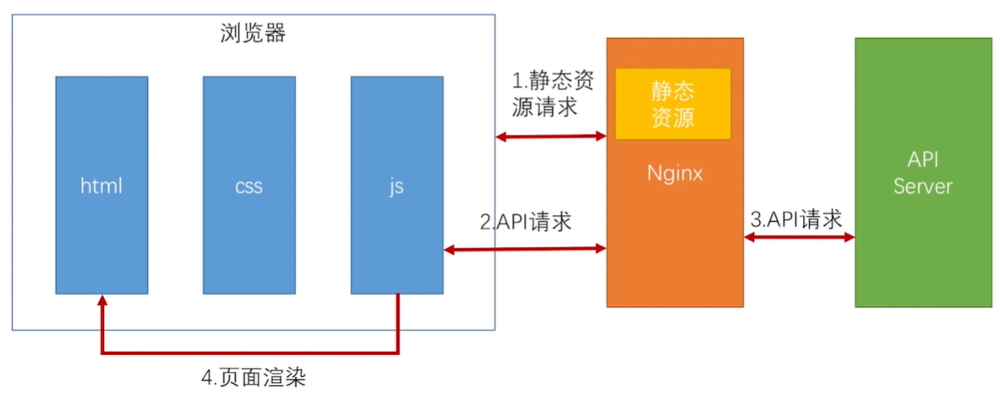
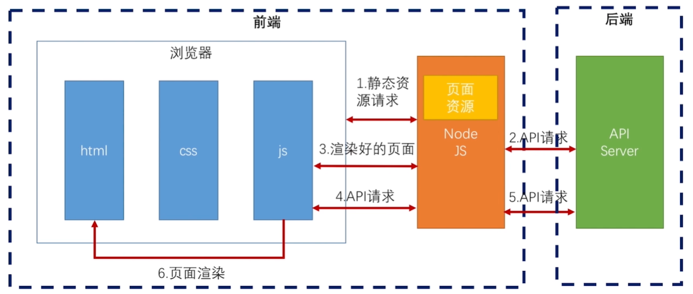
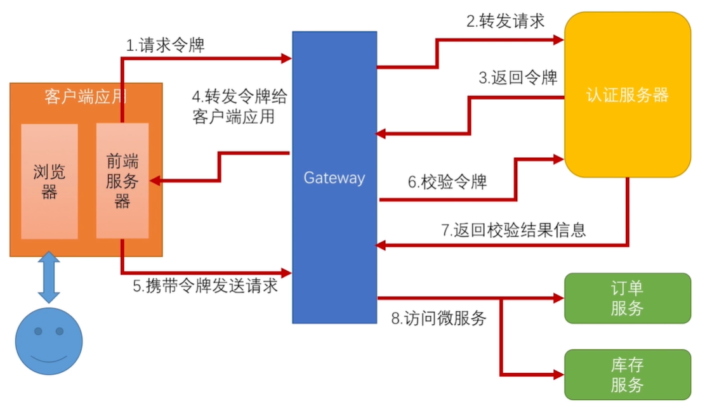

## 1、前后端分离架构

​		1.1、前后端半分离

​		工作流程大致是，访问html页面，加载css、js等静态资源，加载到浏览器时，js会发送一些ajax请求由nginx转发到后端服务器，后端服务器给出相应的json数据，页面解析Json数据，通过Dom操作渲染页面。

​		在这样的架构下，存在一些明显的弊端：

​		SEO（ 搜索引擎优化）非常不方便，由于搜索引擎的爬虫无法爬下JS异步渲染的数据，导致这样的页面，SEO会存在一定的问题；

​		在Json返回的数据量比较大的情况下，渲染的十分缓慢，会出现页面卡顿的情况；

1.2、前后端分离

​		将nginx替换成了NodeJS，浏览器请求NodeJS，NodeJS在发http请求去服务器获取json数据，NodeJS收到json后再渲染出HTML页面，NodeJS直接将HTML页面flush到浏览器，这样，浏览器得到的就是普通的HTML页面，而不用再发Ajax去请求服务器了。

​		在这里，前端不仅包括浏览器，还包括一个NodeJS服务器，后端只负责数据的处理。

## 2、前后端分离的OAuth2认证架构

​		在之前我们实现的OAuth2认证架构中，客户端应用，其实是使用的一些http请求工具，如Restlet Client、Postman等。我们将架构改造为如下，客户端应用，其实应该由浏览器和前端服务器组成。（在这里前端服务器，我们使用SpringBoot模拟实现，在实际工作中，应该是由前端人员使用NodeJS来实现）

## 3、项目改造实现认证流程

​		由上图可知，我们需要改造的有以下两点：第一步请求令牌时，将http请求工具更换为前端服务器来请求令牌；第五步由前端服务器携带令牌请求服务。

