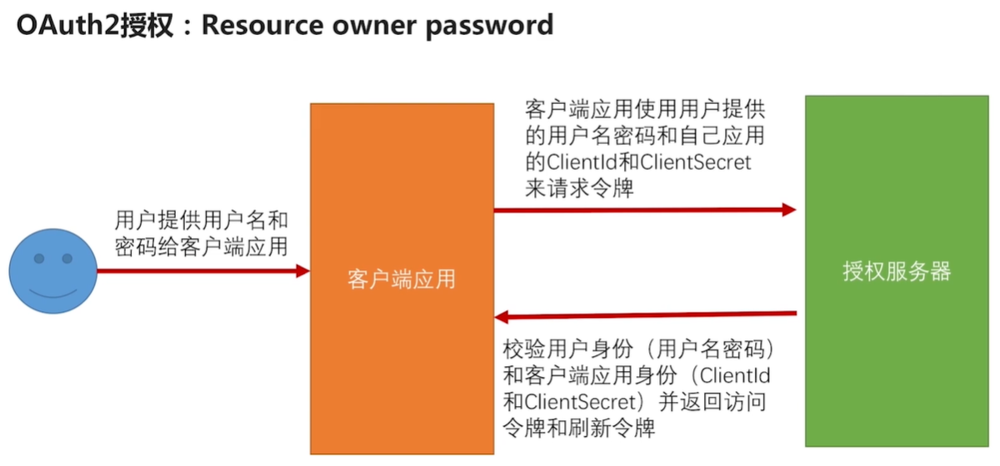
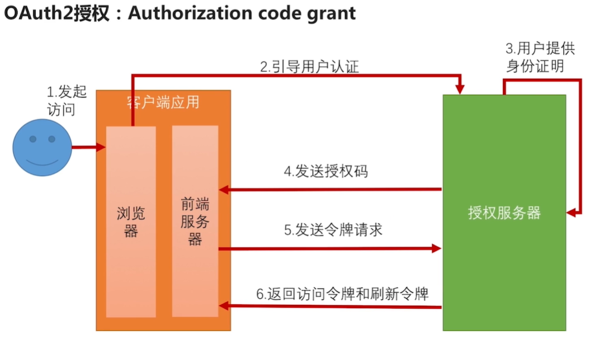
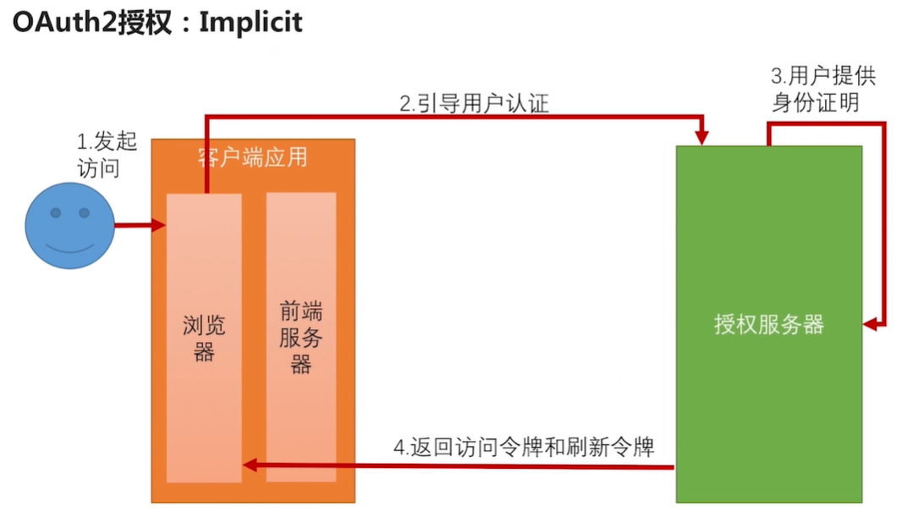
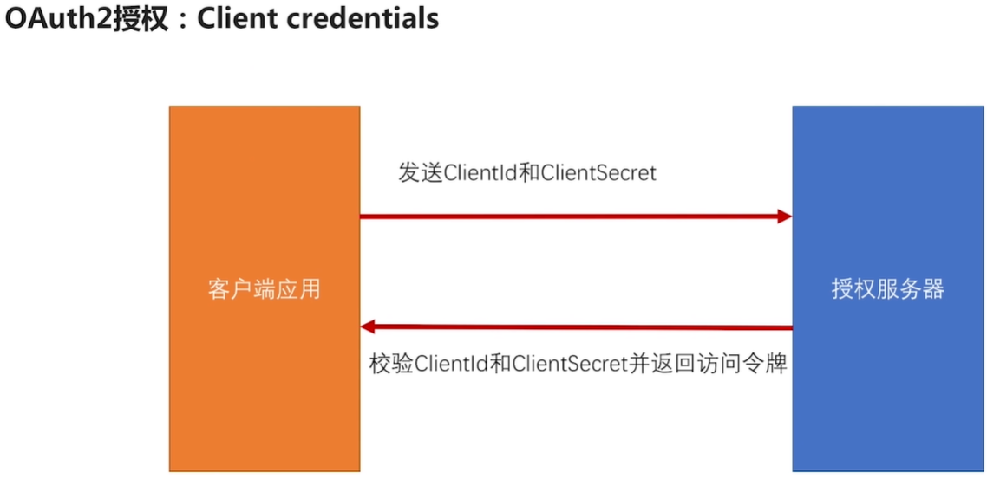

## 1、OAuth2四种模式

1.1、密码模式

​		这也是我们之前一直使用的模式，流程如下；这种模式下，用户敏感信息直接泄漏给了客户端应用，因此这种模式只能用于客户端应用是我们自己开发的。因此密码模式一般用于自己开发的App或单页面应用。

1.2、授权码模式

​		授权码模式是四种模式中最繁琐也是最安全的一种模式。用户向客户端发起请求时，客户端应用引导用户去授权服务器进行认证（需要有客户端id和回调地址），认证成功授权服务器会将授权码发送给客户端应用，客户端应用再通过授权码，客户端id，客户端密码去授权服务器换取令牌，授权服务器验证无误后，将令牌发送给客户端应用。这种场景下，用户的敏感信息没有暴漏给客户端应用，保证了安全。一般适用与客户端应用是Web服务器或第三方的App。

1.3、简化模式（隐式授权模式）

​		简化模式相对于授权码模式省略了，通过授权码换取令牌过程。一般用于没有服务器的前端应用。

4、客户端模式

​		最简单的模式，发出的令牌与用户无关。因此，一般适用于我们完全信任的客户端应用（服务器端服务），并且不需要用户参与。

## 2、改造项目为授权码认证方式

​		目前我们使用的是OAuth2的密码模式，我们来修改为使用授权码模式。

2.1、修改客户端应用，需要用户进行认证时直接引导去认证服务器完成认证

2.2、认证服务器配置支持授权码模式

