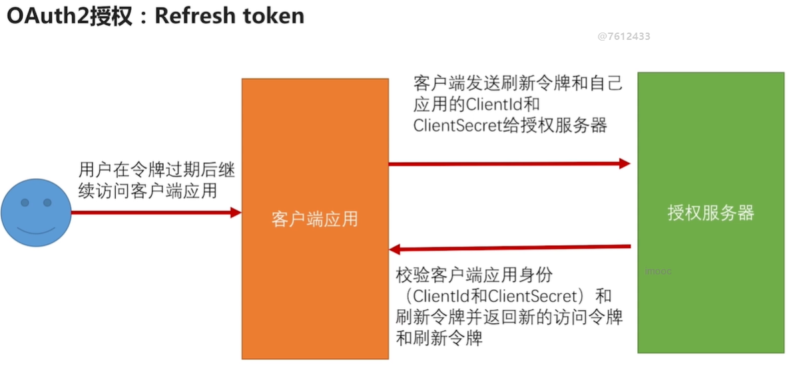

## 1、access_token的有效期

​		我们知道 token的有效期，是控制登陆一次能访问多长时间微服务。那么access_token一般设置多长时间比较好呢？因为有access_token可以直接访问微服务，而不需要再次认证，所以access_token不建议设置很长的有效期，一般为一到两个小时，因为access_token一旦泄漏，风险很高。

​		但是这样又会有一个问题，access_token过期了，而session没有过期，这样会导致，我们还是登陆的状态，但是无法访问微服务了。

## 2、OAuth2的refresh_token

​		为了解决access_token过期的问题，OAuth2协议为我们提供了refresh_token。我们在配置支持refresh_token后，在通过密码模式和授权码模式获取access_token的同时，也会发给我们一个refresh_token。在当access_token过期后，客户端应用可以拿着refresh_token和clientId、clientSecret去授权服务器获取新的access_token，在这个过程中不需要用户再次输入用户名和密码。因为refresh_token要配合clientId、clientSecret一起使用才有效，所以就算泄漏了refresh_token也不要紧，保护好clientSecret就好了。因此refresh_token可以设置较长的时间，一般与认证服务器session过期时间设置一致即可。

## 3、配置项目支持refresh_token

3.1、配置授权服务器支持refresh_token

​	3.1.1、数据库配置authorized_grant_types添加refresh_token，refresh_token_validity设置refresh_token过期时间

​	3.1.2、OAuth2认证服务器配置类的public void configure(AuthorizationServerEndpointsConfigurer endpoints)要配置userDetailsService，因为刷新令牌没有密码只有用户名。

3.2、客户端应用改造access_token过期时，可以刷新令牌

​	SessionTokenFilter中获取出token是要判断access_token是否过期，过期执行刷新令牌操作

## 4、refresh_token过期了怎么办

​		虽然refresh_token的有效期比较长，但还是会过期的。如果refresh_token也过期了怎么处理呢？

​		4.1、refresh_token过期了，不管session过没过期，强制退出，从新输用户名密码进行认证。

​		4.2、refresh_token过期了，到认证服务器重新认证，如果session没过期，发令牌继续使用；如果session过期了，重新输入用户名密码认证。

