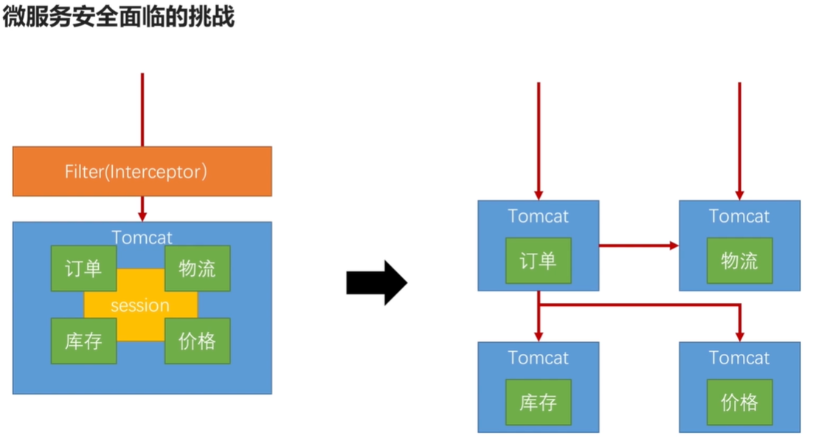
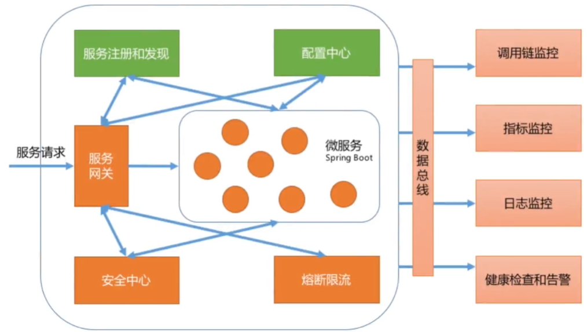

## 1、微服务安全面临的挑战

​		在微服务的架构下，对比单体应用架构的API安全有哪些新的挑战呢？

1.1、更多的入口点，更高的安全风险

​		单体应用的场景下，入口点只有一个，所有的请求都会从这个入口点进来，在这个入口点去建立一组Filter或者Interceptor，就可以控制所有的风险。

​		微服务场景下，业务逻辑不是在一个单一的进程里，而是分散在很多的进程里。每一个进程都有自己的入口点，这就会导致防范的攻击面，比原来大得多，风险也会高的多。

1.2、性能问题

​		单体应用的场景下，所有的业务逻辑都在同一个进程里面，关于安全的信息也都在这里面，想验证身份权限，在这个进程里可以完成的。

​		微服务场景下，需要的安全信息，很可能在当前进程里是没有的，比如说，访问一个订单服务的时候，用户的信息、权限的信息，在订单服务中是拿不到的。需要调用安全中心认证中心去获取相关的这些信息。那么，每一个请求，不管是从外部进来的，还是服务间的调用，都要去做安全校验时，这个远程连接所带来的延迟，有可能会导致服务产生一些性能问题。尤其是对性能极其敏感的一些服务。原来那个服务可能本身几毫秒就能响应了。因为要做远程调用来验证安全，可能又增加了几毫秒。

1.3、服务间通讯安全

​		单体应用的场景下，订单调用价格，调用物流都是在同一个tomcat中，不需要考虑安全问题。

​		微服务场景下，当订单去调用物流的时候，需要跨网络，从一个进程进入另一个进程，要保证这个通讯也是安全的。

1.4、跨多个微服务的请求难以追踪

​		对于一个服务来说，可观测性是一个很重要的指标。可观测性包含了三方面的意义：

​		1.4.1、log日志：在分布式的应用中，每一个进程会单独记录一些日志，这时候就需要有一个机制把所有的日志串起来。

​		1.4.2、Metrics指标监控：就是把日志的一些信息聚合起来，形成一个在一段时间上的某个指标的统计。比如说流量，在单体应用中很好控制。但是在微服务中，每个服务能承受的流量不同，需要有一个机制能控制整个系统的流控。

​		1.4.3、Tracing调用链监控：比如一个请求进来，在订单服务耗时多少，库存服务耗时多少，价格服务服务耗时多少。能看到整个服务的瓶颈在哪里，这也是需要解决的。

1.5、容器化部署问题

​		微服务场景下，最常用的部署手段那就是容器化，证书和IP访问控制比以前复杂。

1.6、微服务间共享用户的登录状态

​		微服务场景下，如何在多个应用之间共享用户的登陆状态，在这个请求中，所涉及到的微服务都可以知道当前用户是谁。

1.7、多语言架构要求每个团队都要有一定的安全经验

​		微服务场景下，每个微服务都可以使用适合的语言开发，有可能订单是java写的，物流是用go写的...。这种情况下，要求各个团队都要有安全经验。

## 2、常见的微服务安全整体架构

上图为常见的微服务安全架构，这里我们主要学习安全中心、如何在网关上做安全处理。

​		

