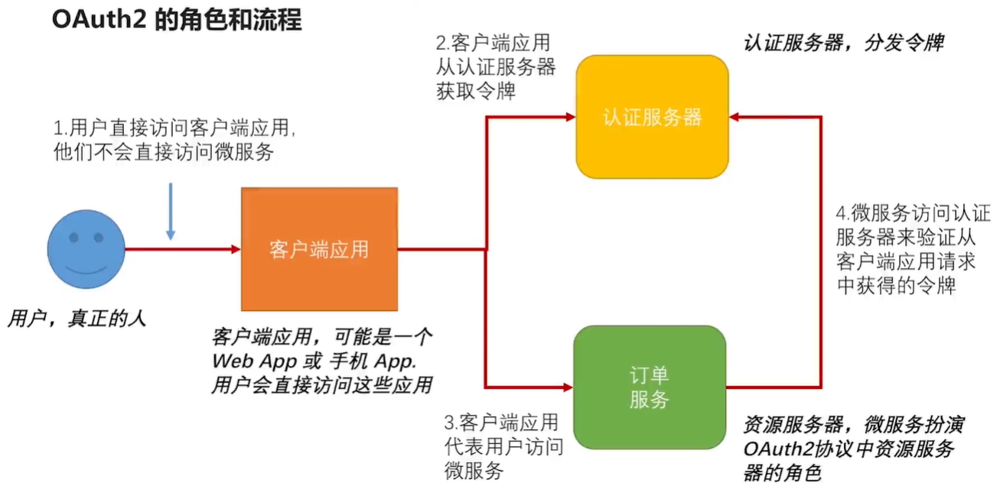
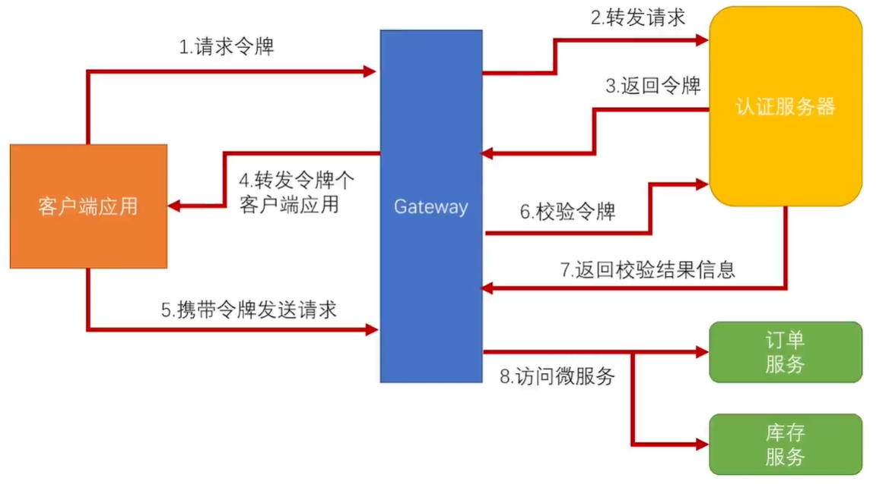

## 1、当前项目存在的问题

​		在前面我们已经完成了一个基于Oauth2认证和授权的流程（如上图）。但是到现在还没有进入到微服务的环境下，如果资源服务器（订单服务），不仅仅是一个单一服务。而是几十个微服务，并且每个微服务都是一个集群，在这样一个流程中存在如下问题：

​		1.1、安全处理和业务逻辑耦合，增加了复杂性和变更成本。

​		1.2、随着业务节点增加，认证服务器压力增大。

​		1.3、多个微服务同时暴漏，增加了外部访问的复杂性。

## 2、引入网关解决问题

​		针对上面的问题，我们引入网关来解决，将安全处理放到网关中，微服务只处理自己的业务；有网关来验证令牌，微服务不与认证服务器直接交互了。对于外部访问来说，只需要网关的地址即可，内部微服务由网关进行转发。

## 3、搭建zuul网关，转发路由

​		3.1、pom中添加zuul依赖

​		3.2、启动类添加@EnableZuulProxy

​		3.3、配置application.yml，配置路由，并将敏感头设置为空

## 4、将在网关上实现认证，审计，授权

​		4.1、删除order微服务上的安全配置，只留下业务代码

​		4.2、在网关上添加OAuth2认证过滤器

​		4.3、添加审计过滤器

​		4.4、添加授权过滤器

## 5、使用spring-cloud-zuul-ratelimit进行限流

​		项目地址：<https://github.com/marcosbarbero/spring-cloud-zuul-ratelimit>

​		5.1、pom中添加spring-cloud-zuul-ratelimit依赖

​		5.2、在限流时需要存放一些信息，需要有相应的存储，推荐使用Redis

​		5.3、application.yml添加限流配置